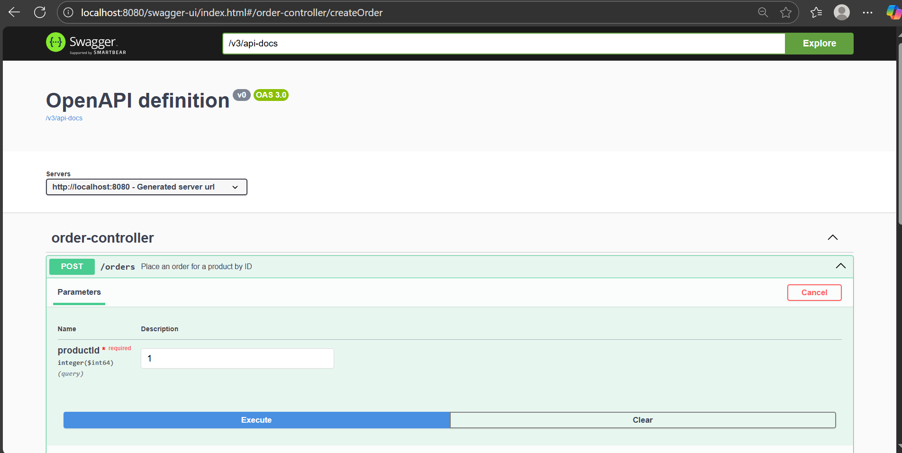
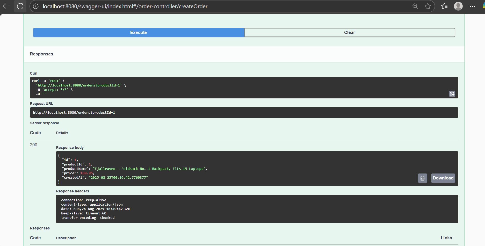
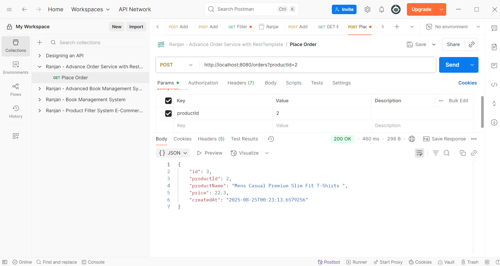
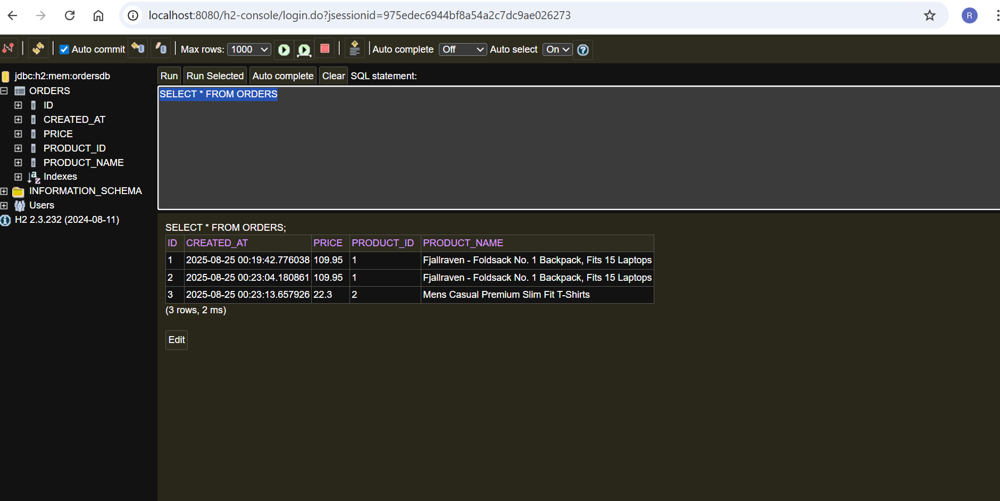

# 🛒 Spring Boot Order API with H2 and External Product Check

This is a Spring Boot REST API that simulates placing an order. Before creating an order, it checks product availability from a **free public API** (`https://fakestoreapi.com`). If the product is available, the order is saved in an **in-memory H2 database**.

---

## ✅ Features

- 📦 Fetch product details from a 3rd-party API (with RestTemplate)
- ✅ Place an order if the product is available
- ❌ Return "Product not available" if out of stock
- 💾 Save order data into H2 in-memory DB
- 🔁 Uses `RestTemplate` for HTTP calls
- 🔧 Clean separation between Controller and Service layers
- ⚠️ Simple exception handling

---

# Test Evidences:

- APIs on Swagger

- Postman Request

- H2 DB console

## 🚀 Getting Started

### 🔧 Prerequisites

- Java 17+
- Spring Boot 3.x
- Spring Web
- Spring Data JPA
- H2 Database
- Lombok (optional)
- Springdoc OpenAPI (Swagger UI)

### ▶️ Run the App

mvn spring-boot:run

## API Endpoints

POST /orders?productId=1

GET http://localhost:8080/api/ai/ask?prompt=Tell me a joke

 
📦 Sample JSON Response

✅ Success
<pre>{
  "id": 1,
  "productId": 1,
  "productName": "Fjallraven - Foldsack No. 1 Backpack",
  "price": 109.95,
  "createdAt": "2025-08-24T13:45:21.123"
}</pre>

❌ Product Not Available
Product not available.

❌ Invalid ID or API Error
Error occurred: 404 Not Found

## Swagger UI
http://localhost:8080/swagger-ui.html

## License
This project is licensed under the MIT License.

## You have some query?
If you have some query, feel free to connect with me here -- [Ranjan Kumar Mandal](https://www.linkedin.com/in/ranjan-kumar-m-818367158/)
